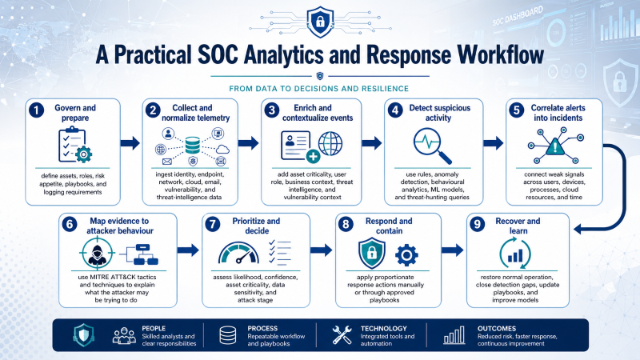

# AI in the Security Operations Center

## From Noisy Alerts to Threat Decisions

# Lecture Overview

A Security Operations Center, or **SOC**, monitors security telemetry, investigates suspicious activity, and coordinates incident response. Modern SOCs receive data from firewalls, identity systems, endpoints, cloud platforms, email gateways, vulnerability scanners, threat intelligence feeds, and network sensors.

The challenge is not only that organizations face attacks. The operational challenge is that defenders must make decisions under:

- **high volume**: thousands or millions of events per day;

- **high uncertainty**: incomplete and sometimes contradictory evidence;

- **high speed**: attackers may move from initial access to impact in minutes or hours;

- **high consequence**: both missed attacks and unnecessary containment can harm the organization.

AI is therefore used not as a magic detector, but as a decision-support layer that helps analysts prioritize, correlate, enrich, explain, and respond.

# Learning Objectives

By the end of this lecture, you should be able to:

1.  Explain why AI is used in modern SOC environments.

2.  Distinguish between raw telemetry, features, alerts, incidents, and response decisions.

3.  Map SOC telemetry to adversary behaviour using a framework such as MITRE ATT&CK.

4.  Explain how AI-based systems perform alert prioritization, anomaly detection, event correlation, and risk scoring.

5.  Analyse why accuracy alone is a poor evaluation measure for SOC models.

6.  Construct a threat hypothesis from incomplete evidence in a multi-stage attack scenario.

7.  Evaluate when response should be automated and when human approval is required.

# Opening Hook: Which Alert Deserves Human Attention?

## Slide 1: The Triage Problem

It is **02:17 a.m.**. The SOC dashboard shows **1,248 alerts**. A human analyst cannot investigate all of them manually.

The practical SOC question is not:

> Can we detect every suspicious event?

The practical SOC question is:

> Which few events deserve human attention now?

Consider three alerts:

| Alert | Description | First Impression |
|:------|:------------|:-----------------|
| A | 300 failed logins from one external IP address | Very noisy and suspicious |
| B | One successful login from a new country, followed by unusual access to cloud storage | Less noisy but potentially more damaging |
| C | Malware signature detected on a quarantined test machine | Serious, but already contained |

> **Discussion question**
>
> Which alert should the SOC analyst investigate first, and why?

## Slide 2: Key Idea

Alert B should probably be investigated first because it combines several risk factors:

- the access was successful;

- the location is unusual;

- the account reached cloud storage;

- the potential impact may involve data exposure.

Alert A may be a blocked brute-force attempt. Alert C may sound serious, but the machine has already been quarantined. Alert B is dangerous because the attacker may already be inside.

> **Key idea**
>
> A SOC is not only an alert detector. A SOC is a decision system. AI is useful when it helps analysts decide which weak signals combine into a credible threat.

# Why AI Is Used in the SOC

AI is used because the SOC faces a mismatch between the scale of machine-generated telemetry and the limited attention of human analysts.

| **SOC Problem**           | **Why It Is Difficult**                    | **How AI Can Help**                                                      |
|:--------------------------|:-------------------------------------------|:-------------------------------------------------------------------------|
| Alert fatigue             | Many alerts are low quality or duplicated  | Cluster, suppress, deduplicate, and prioritize alerts                    |
| Multi-stage attacks       | One event may look harmless in isolation   | Correlate weak signals across time, users, devices, and services         |
| Changing normal behaviour | Static rules become outdated               | Learn behavioural baselines and detect deviations                        |
| Subtle attacker behaviour | Attackers avoid obvious signatures         | Detect rare sequences, low-and-slow activity, and abnormal relationships |
| Heterogeneous evidence    | Logs come from different tools and formats | Normalize, enrich, and connect evidence                                  |
| Operational risk          | Wrong response can disrupt business        | Support proportionate response using risk and confidence                 |

## Rules Are Necessary but Not Sufficient

A traditional rule might be:

```text
IF failed_login_count > 100 THEN create_alert
```

This can detect brute-force attacks, but it may miss more realistic attacks where the adversary already has valid credentials:

```text
Successful login from unusual infrastructure
+ abnormal cloud API calls
+ rare process execution on endpoint
+ unusual SMB access to file server
+ staged archive uploaded to external service
= possible hands-on-keyboard intrusion
```

> **Advanced note**
>
> A mature SOC view separates **event detection** from **threat reasoning**. SOC work is not only classification; it is evidence construction under uncertainty.

# What AI Actually Sees

AI does not directly see attackers, motives, or intentions. It sees traces left in telemetry.

## SOC Telemetry Sources

| **Data Source**     | **Examples of Evidence**                                                                   |
|:--------------------|:-------------------------------------------------------------------------------------------|
| Identity logs       | login time, source IP, device, MFA result, privilege changes, impossible travel            |
| Endpoint telemetry  | process execution, parent-child process relationship, command-line arguments, file changes |
| Network logs        | flows, ports, protocols, traffic volume, east-west movement, unusual destinations          |
| DNS logs            | rare domains, newly registered domains, domain generation patterns                         |
| Email logs          | sender reputation, attachments, URLs, user clicks, phishing indicators                     |
| Cloud audit logs    | API calls, object storage access, token use, VM creation, IAM changes                      |
| Proxy and web logs  | external uploads, downloads, category of destination service                               |
| Threat intelligence | known malicious IPs, domains, hashes, adversary infrastructure                             |
| Asset inventory     | criticality of server, owner, business function, exposure, patch level                     |
| Vulnerability data  | known exploitable weaknesses and missing controls                                          |

## From Events to Entities and Relationships

A mature AI-assisted SOC should not treat logs as disconnected rows. It should connect entities:

```text
User  -> logs into -> Cloud service
User  -> uses      -> Device
Device -> connects to -> File server
Process -> spawns -> PowerShell
Device -> uploads to -> External service
IP address -> associated with -> VPN provider or threat infrastructure
```

This creates an **entity graph**. Graph-based reasoning can help detect suspicious relationships that are not obvious from one log line.

> **Key idea**
>
> A single event asks: “Is this log line suspicious?” A graph asks: “Does this relationship between user, device, process, resource, and destination make sense?”

## Context Changes Meaning

| **Event**                       | **Context**                                     | **Interpretation** |
|:--------------------------------|:------------------------------------------------|:-------------------|
| Large data transfer at midnight | Backup server                                   | Possibly normal    |
| Large data transfer at midnight | HR laptop                                       | Suspicious         |
| PowerShell execution            | System administrator workstation                | Possibly normal    |
| PowerShell execution            | Reception desk computer                         | Suspicious         |
| Login from new country          | User is travelling and uses managed device      | Possibly normal    |
| Login from new country          | User is active locally at the same time         | Highly suspicious  |
| OAuth consent grant             | Approved enterprise app                         | Possibly normal    |
| OAuth consent grant             | Unknown app asking for mailbox and files access | Suspicious         |

# From Raw Logs to Threat Decisions

The workflow below should be understood as a **practical SOC analytics and response workflow**. It is not a single official AI standard. It combines three widely used sources of practice:

1. **NIST CSF 2.0 and NIST SP 800-61 Rev. 3** for incident-response thinking: govern, identify, protect, detect, respond, and recover.
2. **MITRE ATT&CK** for mapping evidence to adversary tactics and techniques.
3. **SIEM/SOAR practice** for collecting telemetry, correlating alerts, generating incidents, automating low-risk tasks, and supporting analyst investigation.

The aim is not to teach that every SOC uses exactly the same pipeline. The aim is to show a practical way to move from raw logs to a defensible security decision.

## A Practical SOC Analytics and Response Workflow

```text
1. Govern and prepare
   -> define assets, roles, risk appetite, playbooks, and logging requirements

2. Collect and normalize telemetry
   -> ingest identity, endpoint, network, cloud, email, vulnerability, and threat-intelligence data

3. Enrich and contextualize events
   -> add asset criticality, user role, business context, threat intelligence, and vulnerability context

4. Detect suspicious activity
   -> use rules, anomaly detection, behavioural analytics, ML models, and threat-hunting queries

5. Correlate alerts into incidents
   -> connect weak signals across users, devices, processes, cloud resources, and time

6. Map evidence to attacker behaviour
   -> use MITRE ATT&CK tactics and techniques to explain what the attacker may be trying to do

7. Prioritize and decide
   -> assess likelihood, confidence, asset criticality, data sensitivity, and attack stage

8. Respond and contain
   -> apply proportionate response actions manually or through approved playbooks

9. Recover and learn
   -> restore normal operation, close detection gaps, update playbooks, and improve models
```



> **Key idea**
>
> AI is mainly used in the middle of this workflow: detection, correlation, prioritization, summarization, and recommendation. Incident ownership, proportionality, legal responsibility, and business-risk decisions remain human and organizational responsibilities.

## How This Relates to Recognised Practice

| **Workflow Part** | **Recognised Practice Behind It** | **Meaning in the SOC** |
|:------------------|:----------------------------------|:-----------------------|
| Govern and prepare | NIST CSF 2.0; NIST SP 800-61 Rev. 3 | Decide what must be monitored, who is responsible, and what response procedures exist before an incident occurs. |
| Collect and normalize | SIEM practice | Bring heterogeneous logs into a searchable and comparable structure. |
| Enrich and contextualize | SIEM/SOAR and threat-intelligence practice | Add meaning to raw events using asset value, identity context, vulnerability data, and known indicators. |
| Detect suspicious activity | SIEM analytics, EDR/XDR analytics, ML-based anomaly detection | Identify events or behaviours that may indicate compromise. |
| Correlate alerts into incidents | SIEM/XDR incident management | Reduce alert noise by grouping related evidence into a single investigation object. |
| Map to attacker behaviour | MITRE ATT&CK | Explain the evidence in terms of adversary objectives such as initial access, execution, persistence, discovery, exfiltration, and impact. |
| Prioritize and decide | SOC triage and risk management | Decide what deserves urgent attention and what can be monitored or closed. |
| Respond and contain | SOAR playbooks; incident-response procedures | Execute approved actions such as token revocation, endpoint isolation, blocking indicators, or ticket escalation. |
| Recover and learn | NIST CSF Recover; post-incident improvement | Restore services, improve detections, update playbooks, and reduce future risk. |

## Step 1: Govern and Prepare

A SOC cannot make good decisions during an incident if the organization has not prepared before the incident. Preparation includes:

```text
- Which systems are critical?
- Which logs must be collected?
- Who owns each system?
- Which actions can be automated?
- Which actions require approval?
- What evidence must be preserved?
- Who must be informed during a serious incident?
```

For example, isolating a student lab machine may be low risk. Isolating a hospital system, payment system, or identity server may require senior approval.

## Step 2: Collect and Normalize Telemetry

Logs arrive in different formats. A firewall event, an identity event, an endpoint event, and a cloud API event do not look the same.

```text
Firewall log:
src_ip, dst_ip, port, protocol, action
```

```text
Identity log:
user_id, login_time, source_ip, MFA_result, device_id
```

```text
Endpoint log:
host_id, process_name, parent_process, command_line, file_hash
```

```text
Cloud audit log:
user_id, API_call, resource_name, object_id, access_time
```

Normalization converts heterogeneous data into a consistent structure so that it can be searched, correlated, and modelled.

## Step 3: Enrich and Contextualize

Raw events rarely contain enough meaning. The SOC enriches them with context:

```text
IP address -> known malicious, residential VPN, Tor exit, cloud provider, usual country?
User -> role, normal working hours, usual device, privilege level?
Device -> managed or unmanaged, criticality, patch level, EDR status?
File or resource -> public, internal, confidential, regulated?
Process -> signed binary, admin tool, suspicious command line?
Cloud API call -> common for this user or rare and high-impact?
```

Context changes the interpretation of the same technical event.

| **Event** | **Low-Risk Context** | **High-Risk Context** |
|:----------|:---------------------|:----------------------|
| PowerShell execution | Domain administrator during maintenance window | HR laptop after phishing click |
| Large data transfer | Backup server to approved storage | Staff laptop to unknown external storage |
| OAuth consent grant | Approved enterprise application | Unknown application requesting mailbox and file access |
| New-country login | User is travelling with managed device | User is active locally at the same time |

## Step 4: Detect Suspicious Activity

Detection can be rule-based, statistical, machine-learning-based, or hypothesis-driven through threat hunting.

| **Detection Method** | **Example** | **Strength** | **Limitation** |
|:---------------------|:------------|:-------------|:---------------|
| Rule-based detection | More than 100 failed logins in 5 minutes | Clear and explainable | Misses subtle attacks using valid credentials |
| Signature detection | Known malware hash or known command pattern | Good for known threats | Weak against new or modified attacks |
| Anomaly detection | User accesses a file share never accessed before | Useful for unknown behaviour | Can create many false positives |
| Behavioural analytics | Login pattern differs from user baseline | Adds user/entity context | Needs historical data and tuning |
| Graph analytics | Unusual relationship among user, device, process, and resource | Good for multi-stage attacks | Requires clean entity resolution |
| Threat hunting | Analyst searches for encoded PowerShell after phishing wave | Flexible and hypothesis-driven | Requires skilled analysts |
| LLM-assisted analysis | Summarise evidence and suggest investigation questions | Useful for explanation and productivity | Must be checked; may hallucinate |

## Step 5: Correlate Alerts into Incidents

A mature SOC should not treat each alert as independent. The important question is:

> Do multiple weak signals combine into a credible threat hypothesis?

Example:

```text
Weak signal 1: phishing email clicked
Weak signal 2: successful login from unusual infrastructure
Weak signal 3: unknown OAuth consent grant
Weak signal 4: encoded PowerShell on endpoint
Weak signal 5: rare file-share access
Weak signal 6: external upload
Weak signal 7: backup deletion attempt

Correlated incident:
Possible account compromise progressing toward data exfiltration and ransomware impact.
```

The purpose of correlation is to reduce noise and create a meaningful investigation object.

## Step 6: Map Evidence to Attacker Behaviour

MITRE ATT&CK helps the SOC describe what the attacker may be trying to achieve.

| **ATT&CK-Style Objective** | **Possible Evidence** | **SOC Question** |
|:---------------------------|:----------------------|:-----------------|
| Initial access | Phishing click, malicious attachment, stolen credentials | How did the attacker enter? |
| Execution | Encoded PowerShell, suspicious script, unusual process tree | What code or command was run? |
| Persistence | OAuth consent grant, new scheduled task, new service | Can the attacker return later? |
| Credential access | Password dumping, suspicious token use, MFA fatigue | Are more accounts compromised? |
| Discovery | Network scanning, file-share enumeration | What is the attacker looking for? |
| Lateral movement | Remote login, SMB access, RDP, admin shares | Has the attacker moved beyond the first host? |
| Collection | Archive creation, unusual access to sensitive folders | What data is being prepared? |
| Exfiltration | External upload, unusual cloud transfer, DNS tunnelling | Has data left the organization? |
| Impact | Backup deletion, encryption behaviour, service disruption | Is ransomware or destructive action underway? |

This mapping improves communication. Instead of saying “there are seven alerts,” the analyst can say:

> The evidence suggests initial access, execution, collection, possible exfiltration, and preparation for impact.

## Step 7: Prioritize and Decide

Prioritization should not depend only on the model score. A practical SOC decision considers:

```text
- likelihood that the activity is malicious;
- confidence and quality of the evidence;
- criticality of the affected asset or account;
- sensitivity of the data involved;
- current attack stage;
- potential business disruption caused by response;
- reversibility of the proposed action;
- legal, regulatory, and reporting implications.
```

A simple classroom scoring model can help discussion, but it is not an industry standard formula. In practice, each organization tunes severity according to its own assets, risks, and response procedures.

| **Priority Factor** | **Low Priority Example** | **High Priority Example** |
|:--------------------|:-------------------------|:--------------------------|
| Asset criticality | Test machine | Identity server or finance system |
| Account privilege | Standard user | Domain administrator or cloud administrator |
| Evidence confidence | One weak anomaly | Multiple independent telemetry sources |
| Attack stage | Scanning attempt | Exfiltration or backup deletion |
| Response risk | Reversible enrichment query | Isolating a production server |

## Step 8: Respond and Contain

Response should be proportionate to evidence and risk. SOAR playbooks can automate routine, reversible, and low-risk tasks.

| **Usually Safe to Automate** | **Usually Requires Human Approval** |
|:----------------------------|:------------------------------------|
| Enrich IP address or domain | Disable administrator account |
| Collect related logs | Isolate production server |
| Create incident ticket | Block business-critical traffic |
| Group duplicate alerts | Terminate cloud workloads |
| Query threat intelligence | Delete files or revoke broad permissions |
| Notify analyst channel | Report breach externally |

Automation is useful, but uncontrolled automation can create outages or destroy evidence.

## Step 9: Recover and Learn

The workflow does not end when the attacker is contained. A mature SOC asks:

```text
- What was the root cause?
- Which controls failed?
- Which detections worked?
- Which detections were missing?
- Did response actions create unnecessary disruption?
- Should playbooks, rules, models, or training be updated?
```

This feedback loop turns an incident into improved resilience.

# Why Accuracy Alone Is Not Enough

A common beginner mistake is to say: “The model is 95% accurate, so it is good.” In a SOC, this can be misleading because real attacks are rare.

Assume a SOC processes **100,000 events** in one day. Suppose only **100** of them are truly malicious. A model has:

- 95% true positive rate;

- 1% false positive rate.

Then:

| **Measure**     | **Result**                                          |
|:----------------|:----------------------------------------------------|
| True positives  | 95 malicious events detected                        |
| False negatives | 5 malicious events missed                           |
| False positives | approximately 999 benign events incorrectly alerted |
| Precision       | $95 / (95 + 999) \approx 8.7\%$                     |

> **Discussion question**
>
> Why can a model with a low false positive rate still overwhelm the SOC?
>
> **Suggested answer:** Because benign events are far more common than malicious events. Even a small false positive rate can generate many false alerts.

> **Key idea**
>
> For SOC evaluation, consider precision, recall, false positive cost, false negative cost, time-to-detect, time-to-triage, explainability, and response impact.

# Higher-Level Mini-Case: Multi-Stage Ransomware and Cloud Exfiltration

## Scenario

A university department is targeted by an attacker. The attacker begins with phishing, obtains valid credentials, abuses cloud access, moves laterally through the network, stages sensitive research data, and then prepares for ransomware impact.

This scenario is more advanced than a simple unusual-login case because it requires reasoning across identity, email, endpoint, network, and cloud evidence.

## Timeline of Evidence

| **Time** | **Observed Evidence**                                                        | **Telemetry Source**                  | **SOC Interpretation**                                    |
|:---------|:-----------------------------------------------------------------------------|:--------------------------------------|:----------------------------------------------------------|
| 09:12    | Staff member clicks a link in a delivery-themed email                        | Email security gateway and click logs | Possible phishing entry point                             |
| 09:18    | Successful login from residential VPN infrastructure using valid credentials | Identity logs                         | Valid account misuse; not enough alone, but suspicious    |
| 09:21    | Unknown OAuth application requests access to mailbox and cloud files         | Cloud audit logs                      | Possible token abuse or persistence through consent grant |
| 09:42    | Endpoint runs PowerShell with encoded command after browser activity         | EDR telemetry                         | Suspicious execution pattern                              |
| 10:05    | Device connects to multiple file shares it rarely accesses                   | Network and file server logs          | Discovery or lateral movement                             |
| 10:26    | Large archive file is created and uploaded to an external storage service    | Endpoint, proxy, and cloud logs       | Data staging and possible exfiltration                    |
| 10:40    | Attempts to disable backups and delete shadow copies                         | EDR and Windows event logs            | Ransomware preparation or impact phase                    |

## Mapping to Adversary Behaviour

Do not only list events. Map the evidence to attacker objectives.

| **Adversary Objective**    | **Evidence in the Case**                | **Relevant SOC Question**                                         |
|:---------------------------|:----------------------------------------|:------------------------------------------------------------------|
| Initial access             | Phishing link click and credential use  | Was the user phished, and were credentials captured?              |
| Persistence or token abuse | Unknown OAuth consent grant             | Can the attacker continue access even after password reset?       |
| Execution                  | Encoded PowerShell execution            | Is this legitimate administration or malicious command execution? |
| Discovery and collection   | Rare file share access and data archive | What data was accessed and staged?                                |
| Exfiltration               | Upload to external storage service      | Was sensitive data transferred outside the organization?          |
| Impact                     | Backup deletion attempts                | Is ransomware deployment imminent?                                |

> **Key idea**
>
> This case encourages threat-hypothesis thinking: “The attacker is moving from valid account access toward data theft and ransomware impact.”

## What the AI System Does

The AI-assisted SOC does not simply say “malicious” or “benign”. It supports investigation by combining evidence.

```text
Evidence cluster:
- Phishing click by same user
- Successful login from unusual infrastructure
- Unknown OAuth consent grant
- Encoded PowerShell on managed endpoint
- Rare access to file shares
- Archive creation and external upload
- Backup deletion attempts
```

```text
Threat hypothesis:
Possible hands-on-keyboard intrusion progressing toward data exfiltration and ransomware impact.
```

```text
Risk level:
Critical
```

```text
Recommended immediate actions:
1. Revoke cloud sessions and OAuth tokens.
2. Isolate the endpoint from the network.
3. Disable or reset the affected account after preserving evidence.
4. Block the external upload destination temporarily.
5. Check whether other users clicked the same phishing link.
6. Preserve logs and start incident response procedures.
```

## What the Human Analyst Must Validate

The analyst should validate:

1.  Was the OAuth application approved by IT or by the user?

2.  Is PowerShell execution normal for this role and device?

3.  Which files were accessed, archived, and uploaded?

4.  Was the external destination personal cloud storage, attacker infrastructure, or a legitimate service?

5.  Are backup deletion attempts confirmed, or are they false positives?

6.  Are other users affected by the same phishing campaign?

7.  What containment action is proportionate to the evidence and business impact?

> **Advanced note**
>
> A strong analysis connects technical evidence, attacker behaviour, model output, and operational response.

# Interactive Activity: Build a Threat Hypothesis

## Activity Goal

Construct a threat hypothesis from incomplete evidence. Avoid two weak responses:

- **Overreaction:** “Disable everything immediately.”

- **Underreaction:** “It is only one suspicious login.”

## Activity Questions

Work through the following questions:

1.  Which evidence items are weak signals, and which are strong signals?

2.  Which events map to initial access, execution, collection, exfiltration, and impact?

3.  What is the most plausible threat hypothesis?

4.  Which immediate containment actions are justified?

5.  Which actions should require human approval?

6.  What additional evidence would reduce uncertainty?

## Example High-Quality Answer

A strong answer should say something like:

> The case suggests a multi-stage intrusion rather than a single anomalous login. The phishing click and valid login are early signals. The OAuth consent grant increases concern because token access may survive password reset. Encoded PowerShell, rare file share access, archive creation, external upload, and backup deletion attempts together support a high-confidence hypothesis of data theft followed by ransomware preparation. Immediate containment is justified, but destructive actions should be controlled and evidence should be preserved.

## Illustrative Risk-Prioritization Exercise

The following exercise is a simplified classroom model, not a standard industry formula. It is included to help reason about why the case deserves urgent escalation.

Score the case from 0 to 5 for each dimension:

| **Dimension**          | **Score** | **Reason**                                                                 |
|:-----------------------|:----------|:---------------------------------------------------------------------------|
| Anomaly strength       | 5         | Multiple abnormal behaviours across identity, endpoint, network, and cloud |
| Evidence confidence    | 4         | Several independent telemetry sources confirm the pattern                  |
| Asset/data criticality | 4         | Research files and institutional data may be sensitive                     |
| Attack-stage severity  | 5         | Evidence reaches exfiltration and possible impact phase                    |

Using the illustrative classroom formula:

$$\text{Risk Score} = 0.35A + 0.25B + 0.20C + 0.20D$$

we get:

$$0.35(5) + 0.25(4) + 0.20(4) + 0.20(5) = 4.55/5$$

This supports urgent escalation in this teaching scenario. In a real SOC, severity would also depend on the organisation's own playbooks, business impact, and evidence-handling rules.

# Why AI Fails in SOC Environments

AI is useful, but it fails in predictable ways. These failure modes are important in real SOC environments.

## Failure 1: Missing or Poor-Quality Data

If endpoint logs are missing, the AI system may see a suspicious login but not the execution that follows.

```text
Identity logs: suspicious login observed
Endpoint logs: missing
Cloud logs: delayed
Result: incomplete investigation picture
```

## Failure 2: Lack of Context

AI may treat legitimate maintenance as malicious if it does not know the user’s role or the maintenance window.

```text
PowerShell at midnight by domain administrator: possibly normal
PowerShell at midnight by HR laptop: suspicious
```

## Failure 3: Concept Drift

Normal behaviour changes over time.

```text
During exam registration, university systems may receive unusual traffic.
A model trained during a quiet period may generate many false positives.
```

## Failure 4: Base-Rate Problem

Even a model with a low false positive rate can overwhelm analysts because real attacks are rare. This is why precision and operational workload matter.

## Failure 5: Adversarial Adaptation

Attackers can change behaviour to avoid detection.

```text
Instead of uploading 5 GB at once,
the attacker uploads 50 MB every hour for several days.
```

This low-and-slow behaviour may evade simple threshold rules.

## Failure 6: Explainability Gap

A poor alert says:

```text
Risk score: 94%
```

A better alert says:

```text
Risk score: 94%
Main reasons:
- Unknown OAuth consent grant
- Encoded PowerShell execution
- Rare file-share access
- Archive creation
- External upload
- Backup deletion attempt
```

SOC analysts need reasons, not only scores.

## Failure 7: Automation Risk

Automated containment can cause damage.

```text
The AI system disables a critical administrator account.
The alert was a false positive.
A production outage cannot be fixed quickly.
```

> **Key idea**
>
> In cybersecurity, false negatives may allow attacks, but false positives can also disrupt the organization. Good SOC design must balance both.

# Human-in-the-Loop SOC

AI should support human analysts, not replace them completely.

## What AI Can Do Well

AI can support:

- alert grouping and deduplication;

- anomaly detection;

- entity correlation;

- behavioural baselining;

- threat intelligence enrichment;

- incident summarization;

- evidence ranking;

- recommended next investigative steps.

## What Humans Still Do Better

Human analysts are needed for:

- understanding business impact;

- judging incomplete and conflicting evidence;

- communicating with users, managers, and legal teams;

- making high-impact containment decisions;

- understanding ethical and regulatory consequences;

- deciding whether response is proportionate.

## What Can Be Automated?

Low-risk and reversible actions are good candidates for automation:

```text
Collect related logs
Query threat intelligence
Group similar alerts
Enrich IP addresses and domains
Generate an incident summary
Create an investigation ticket
Trigger step-up authentication
```

## What Should Require Human Approval?

High-impact or irreversible actions should usually require approval:

```text
Disable administrator account
Isolate production server
Block business-critical traffic
Terminate cloud workloads
Delete files
Report breach externally
```

# Review Questions

## Q1. Why is the most obvious alert not always the most dangerous alert?

**Suggested answer:** Because a noisy alert may be blocked or contained, while a less obvious successful compromise may create greater risk.

## Q2. What is the difference between an alert and an incident?

**Suggested answer:** An alert is usually a warning signal from one source. An incident is a correlated set of evidence that suggests a meaningful security problem requiring response.

## Q3. Why is an OAuth consent grant dangerous in the mini-case?

**Suggested answer:** Because it may give an attacker persistent cloud access through tokens or application permissions, even if the user password is later changed.

## Q4. Why can a 95% accurate model still be operationally poor?

**Suggested answer:** Because attacks are rare. A small false positive rate can still produce many false alerts and overwhelm analysts.

## Q5. Why should a SOC map evidence to attacker tactics?

**Suggested answer:** It helps analysts understand attacker objectives, identify missing evidence, prioritize response, and communicate findings using a common language.

## Q6. What should be automated, and what should remain human-controlled?

**Suggested answer:** Evidence collection, enrichment, alert grouping, and ticket creation can often be automated. High-impact containment actions should usually require human approval.

# Final Takeaway

AI in the SOC is not about replacing analysts. It is about improving the quality and speed of security decisions.

```text
AI in the SOC:
1. Sees telemetry, not intentions.
2. Converts raw events into features and relationships.
3. Correlates weak signals into threat hypotheses.
4. Prioritizes incidents under uncertainty.
5. Requires context, explainability, and human judgment.
6. Should support proportionate and accountable response.
```

> The best SOC is not the one with the most alerts. The best SOC is the one that turns telemetry into timely, explainable, and proportionate action.

# Suggested Reading

1. NIST. [*SP 800-61 Rev. 3: Incident Response Recommendations and Considerations for Cybersecurity Risk Management*](https://csrc.nist.gov/pubs/sp/800/61/r3/final).

2. NIST. [*Artificial Intelligence Risk Management Framework*](https://www.nist.gov/itl/ai-risk-management-framework).

3. MITRE. [*ATT&CK Enterprise Matrix*](https://attack.mitre.org/matrices/enterprise/).

4. CISA. [*Cybersecurity Incident and Vulnerability Response Playbooks*](https://www.cisa.gov/resources-tools/resources/federal-government-cybersecurity-incident-and-vulnerability-response-playbooks).

5. Microsoft. [*Microsoft Sentinel Documentation*](https://learn.microsoft.com/en-us/azure/sentinel/).


